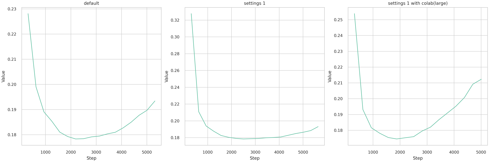

# SNS 사진 분석 댓글 및 피드백 프로젝트

- 파이썬 버전
    ```bash
    conda create -n project_3 python==3.11
    ```
- 패키지 설치
    ```bash
    git clone https://github.com/crazy2894/project_3_git.git
    cd project_3_git
    pip install -r requiremets.txt
    ```

### t5
- 사용 데이터 셋 : [gpt 생성 데이터](data/text_data/output_text.json)
  -[gpt 생성 코드](code/code_data_gen/3_textdata_generating)
- transfer_0 : 기본값으로 훈련
- transfer_1 : 
  - 공통 사항
    - 드롭 아웃 비율 조정 기본값 : 0.1 -> 0.2<br>
    - 학습 률 조정<br>
    - 웜 업 스텝 설정<br>
    - 배치 사이즈 : 코랩에서 돌릴때 시도<br>
    - l2 정규화 (weight decay)<br>
    - gredient clipping 그라디언트 조정으로 학습 안정화 시키기<br>
    - 레이블 스무딩<br>
  - transfer_1 : 로컬 환경 및 기본 base 모델 이용
  - transfer_1_large_colab : colab 환경 및 large 모델이용

- t5 비교 그래프
  

## 파일 구조

### 📁 code : 모델 훈련 및 예측, 데이터 확인관련 코드
```text
1_데이터 확인.ipynb           # 데이터 확인 코드
2_od_YOLO_finetunning.ipynb  # wassup 얼굴 데이터 전이학습
2_od_YOLO_lvis.ipynb         # lvis 데이터셋 전이학습
3_lm_gpt2finetunning         # gpt2 전이학습
3_lm_t5                      # t5 전이학습
4_pipe_line                  # 입력단부터 최종 출력단 까지으 파이프라인
```

### 모델 설명
```text
yolov8m-oiv7.pt              # 객체 검출 모델 중간 사이즈
yolov8x-oiv7.pt              # 객체 검출 모델 라지 사이즈
yolov10n-face.pt             # wassup dataset으로 전이학습한 모델
```

### 📁 code_data_gen : api 를 이용한 코드
```text
1_chat_gpt_translate.ipynb   # 텍스트 번역 모델 (oiv7 의 정답 라벨 번역을 위한 코드)
2_img_pred_and_gen.ipynb     # 이미지를 모델 입력 후 출력 값을 결과를 저장하는 코드
3_textdata_generating.ipynb  # text to text 로 댓글 데이터 생성 코드
```


<details>
  <summary>업데이트 내용</summary>
  
  ### 2024-09-02
    code\1_데이터_확인.ipynb  : fix
    requiremets.txt         : 필요한 라이브러로 수정(업데이트 중)

</details>

# 링크 : [진행과정 표](https://docs.google.com/spreadsheets/d/1OklwBcfJiqlj7JJHE1Pez9jpgLctun0BPKrBD4HW2A0/edit?gid=1967477975#gid=1967477975) , [기획안](https://docs.google.com/presentation/d/1HKMJk6zLfsEqedcVdcQipHY8V8snd6oP2ajS9FDFgKI/edit#slide=id.p), 