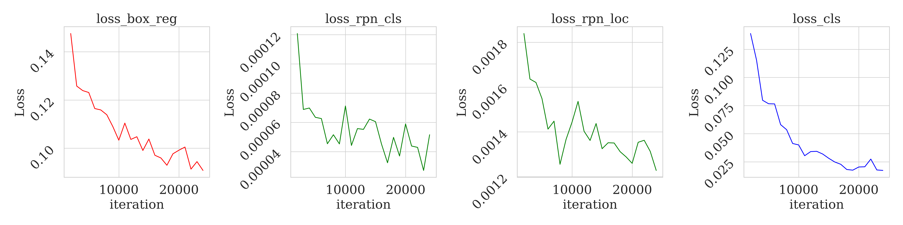

# SNS 사진 분석 댓글 및 피드백 프로젝트

- 파이썬 버전
    ```bash
    conda create -n project_3 python==3.11
    ```
- 패키지 설치
    ```bash
    git clone https://github.com/crazy2894/project_3_git.git
    cd project_3_git
    pip install -r requiremets.txt
    ```

#### 공통 사항
**모든 모델에서 earlystopping ,patient = 10 이용**<br>
**(Faster R-CNN 제외 : 커스텀 ealrystop 요구)**

## to do list 및 ckeck list

- 공식 tta 성능지표 확인 후 적용 가능시 적용시 비교 **진행중**
- ~~각각 왜 이 모델을 썼는지 정확한 사항 기재~~ **완료**
- 지표 및 성과 또한 정확히 공식 tta 기준 확인후 비교 지표로 지정 **진행중**
- 15 분 발표 시간 맞추기
현업 사업 용역 : 
https://vercel.com/docs
https://vast.ai/pricing
https://www.wishket.com/partners/
https://cs.tta.or.kr/tta/introduce/introListR.do
https://www.perplexity.ai/

- 공식 tta 성능지표 확인 후 적용 가능시 적용시 비교

- ~~왜 이 모델들을 썼는지 정확히~~ 완료
- 성과 지표 정확히
- 15 분

### what to do
2024 - 09 - 08 : yolo 및 ssd 평가지표 기준으로 평가하기


# Oject Detection + classification 모델
### 사용 모델 및 이유 : 
#### 오브젝트 디텍션 모델
- detectron2 : https://github.com/facebookresearch/detectron2
  - faster_rcnn_R_50_FPN_3x : 얼굴 데이터 감정 분류 **전이 학습**
    ```
    **전이 학습**
    높은 정확도, 감정 분류에 이용, Yolo 와 성능 비교를 위해 사용 됨
    ```

- ultralytics : https://www.ultralytics.com/ko
  - [yolov10n](https://github.com/THU-MIG/yolov10) : 얼굴 데이터 감정 분류 **전이 학습**
    ```
    **전이 학습**
    빠른 추론 및 실시간 감정분류 가능, 적은 비용으로 좋은 성능을 냄, SOTA 모델
    ```
  - [yolov8x-oiv7](https://docs.ultralytics.com/ko/datasets/detect/open-images-v7/#open-images-v7-pretrained-models) 
    ```
    **사전 학습 모델**
    객체 검출 사전 학습 모델 이용
    쉽게 불러와 사용 가능 하다
    ```

#### 언어 모델(Transformer based) :
- T5 **전이 학습**
  - T5-base : https://huggingface.co/paust/pko-t5-base
  - T5-large : https://huggingface.co/paust/pko-t5-large
  ```
  **전이 학습**
  공통 : 상대적으로 LLM 보다 작은 모델임에도 정해진 테스크에서 높은 성능을 보임
  비교를 위해 base 모델과 large 모델 이용
  ```
- gpt2 **전이 학습**
  - kogpt2 : https://huggingface.co/skt/kogpt2-base-v2
  - gpt2 : https://huggingface.co/openai-community/gpt2
  ```
  **전이 학습**
  공통 : 트랜스 모델 기반의 모델로, 자유로운 텍스트 생성 능력이 뛰어남 llm들의 초기모델.
  kogpt2 : 한국어에 특화된 gpt2 모델. 한국어에 대하여 자연스러운 생성 예상.
  gpt2 : 한국어 모델과 비교.
  ```

### [api : 데이터 생성](code_data_gen/3_textdata_generating.ipynb)
- chat gpt4o-mini
  ```
  기존 chat gpt4 에 비해 저렴하다.
  ```
- gemini-1.5-flash
  ```
  무료로 사용 가능. 하지만 요청 횟수가 제한되어 있다(15 요청/분)
  ```
### 사용 데이터 셋 :
- 이미지 데이터 셋: wassup 안면 데이터
  - 기본 json 형식을 yolo 형식으로 annotation 변환 : [코드](code/1_2데이터_전처리_yolo.ipynb)
  - yolo 형식에서 COCO데이터셋으로 변환 : [코드](code/1_3데이터_전처리_ssd,rcnn.ipynb)

- 텍스트 데이터 셋 : 출력된 이미지 라벨[감정 분류 및 ,yolov8x-oiv7 출력] 을 이용하여 생성 : [코드](code_data_gen/3_textdata_generating.ipynb)
  - gemini 및 gpt api 이용 및 프롬프트 엔지니어링
    ```py
    def prompting(input_):
      return f"""
    사진에 대한 댓글 입력
    질문 금지
    sns 사진 요소 : '분노, 여자, 인간의 얼굴, 공, 의류'
    sns 댓글 : 화가 난 듯한 표정이네! 🏀 공은 무슨 종류야? 옷도 멋지다! 😊
    
    예측 한 문장
    sns 사진 요소 : {input_}
    sns 댓글 : """
    ```
# 모델 학습 및 결과

## 성과 성능 지표 설정

### 언어 모델 : BLEU-N, METEOR, ROUGE-N
### 객체 탐지 모델 : Macro Average, Weighted Average, Micro Average

참조 : https://test.tta.or.kr/tta/main/main.do

## Obect Detection 1 : Faster R-CNN
### detectron2 from facebook
- 기본적으로 detectron2 의 faster-rcnn 을 이용함
  ```bash
  git clone https://github.com/facebookresearch/detectron2.git
  python -m pip install -e detectron2
  ```

### 최종 결과
```
- 소요 시간 : 약 7000 step / 5.12 시간
- 필요 리소스 : 약 4GB의 메모리
- 최종 metrics : mAP50 87.23 %
```

###  [**데이터 전처리**](code/1_3데이터_전처리_ssd,rcnn.ipynb)
```
기본 적으로 COCO 데이터 셋과동일한 형식
문제 : 사진의 width 와 height를 불러올 때 올바르게 불러와 지지 않음
해결 : => exif 를 이용하여 회전 데이터를 가져와서 적용함
```
- 전처리 코드 함수 정의
  ```py

    def read_image_size_from_exif(image_path):
      with Image.open(image_path) as img:
          # EXIF 데이터 가져오기
          exif = img._getexif()

          # EXIF 데이터가 없을 경우 기본 크기 반환
          if exif is None:
              return img.size

          # Orientation 태그 가져오기
          orientation_key = [key for key, val in TAGS.items() if val ==   'Orientation'][0]
          orientation = exif.get(orientation_key, 1)  # EXIF에서 Orientation  값이 없으면 기본값 1을 사용

          # Orientation에 따라 이미지 회전
          if orientation == 3:
              img = img.rotate(180, expand=True)
          elif orientation == 6:
              img = img.rotate(270, expand=True)
          elif orientation == 8:
              img = img.rotate(90, expand=True)

          # 회전된 후의 이미지 크기 반환
          return img.size
  # 이후 YOLO 형식의 annotation => COCO 형식의 annotation
  ```
###  [**훈련 코드**](code/2_RCNN_0_transfer.ipynb)
  - 설정 하이퍼 파라미터에 대한 설명
    ```py
    cfg = get_cfg()

    # 어떤 백본 모델을 이용할지 설정 (현제 설정값 : resnet-50) 추가 백본 확인
    #https://github.com/facebookresearch/detectron2/tree/main/configs/COCO-Detection
    cfg.merge_from_file("detectron2/configs/COCO-Detection/faster_rcnn_R_50_FPN_3x.yaml")
    # 데이터 셋 설정
    cfg.DATASETS.TRAIN = ("face_data_set",)
    cfg.DATASETS.TEST = ("face_data_set_valid",)

    # 데이터 로딩 사용 프로세서 수
    cfg.DATALOADER.NUM_WORKERS = 2

    # 초기 가중치 COCO 데이터셋을 사용해 학습된 Mask R-CNN 모델의 가중치를 사용
    cfg.MODEL.WEIGHTS = "detectron2://COCO-InstanceSegmentation/mask_rcnn_R_50_FPN_3x/137849600/model_final_f10217.pkl"
    
    # 각 배치(batch)당 이미지 수를 지정
    cfg.SOLVER.IMS_PER_BATCH = 16

    # 학습의 기본 학습률(learning rate)을 지정
    cfg.SOLVER.BASE_LR = 0.001
    # 최대 학습 반복 횟수(iterations)를 지정
    cfg.SOLVER.MAX_ITER = 1000

    # 사진 리 사이징 (yolo 와 같은 비교를 위해)
    cfg.INPUT.MIN_SIZE_TRAIN = 512
    cfg.INPUT.MAX_SIZE_TRAIN = 512
    cfg.INPUT.MIN_SIZE_TEST = 512
    cfg.INPUT.MAX_SIZE_TEST = 512

    # 데이터 증강
    cfg.INPUT.RANDOM_FLIP = "horizontal"
    cfg.INPUT.RANDOM_ROTATION = 30
    cfg.INPUT.CROP = CN({"ENABLED": True, "TYPE": "relative_range", "SIZE": [0.8, 0.8]})

    # Region Of Interest 배치 크기 지정 및 클래스 개수 지정
    cfg.MODEL.ROI_HEADS.BATCH_SIZE_PER_IMAGE = 128
    cfg.MODEL.ROI_HEADS.NUM_CLASSES = 4

    # 출력
    cfg.OUTPUT_DIR = "./models/faster_rcnn_R_50_FPN_3x"

    # 평가 / iter
    cfg.TEST.EVAL_PERIOD = 1000

    # 저장 / iter
    cfg.SOLVER.CHECKPOINT_PERIOD = 500

    # 웜업 iter 정하고 스케줄러 이름 정하기
    cfg.SOLVER.LR_SCHEDULER_NAME = "WarmupCosineLR"
    cfg.SOLVER.WARMUP_ITERS = 500
    ```
### 바운딩 박스 메트릭

1. **loss_box_reg (박스 회귀 손실)**:
   - 전체적으로 감소하는 추세를 보이고 있음.
   - 초기적인 값은 0.15 정도였으나, 점점 낮아져 0.09 근처로 안정화되고 있음.
   - 이는 모델이 예측한 박스와 실제 박스 간의 차이를 줄이고 있다는 것을 의미함.

2. **loss_rpn_cls (RPN 클래스 손실)**:
   - 이 손실 또한 감소하고 있지만, 중간에 약간의 변동성이 있음.
   - 초기에는 약 0.00012 부근에서 시작했으며, 결국 0.00004로 떨어짐.
   - RPN의 클래스 예측 정확성이 향상되고 있음을 나타냄.

3. **loss_rpn_loc (RPN 위치 손실)**:
   - 이 손실은 전체적으로 점진적으로 감소하는 경향이 있음.
   - 초기 값은 약 0.0018에서 시작하여 현재는 0.0012 정도가 되어, 제안된 지역의 위치 예측이 정확해지고 있음을 보여줌.

#### 요약
종합적으로, 세 가지 손실 모두 감소하는 추세를 보이고 있으며, 이는 모델이 점차 더 나은 성능을 보이고 있음을 나타냄. 훈련이 진행됨에 따라 손실 값들이 안정화되고 있음을 통해 효과적인 학습이 이루어지고 있음을 알 수 있음.


<details>
  <summary>최종 결과 metrics</summary>

- 최종 결과 metrics
  | Metric                           | Value                      |
  |----------------------------------|----------------------------|
  | bbox/AP                          | 74.22026                   |
  | bbox/AP-angry                    | 71.10707                   |
  | bbox/AP-happy                    | 82.11466                   |
  | bbox/AP-sad                      | 72.93612                   |
  | bbox/AP-surprised                | 70.72321                   |
  | bbox/AP50                        | 87.23360                   |
  | bbox/AP75                        | 86.68937                   |
  | bbox/APl                         | 74.22026                   |
  | bbox/APm                         | 0                          |
  | bbox/APs                         | 0                          |
  | data_time                        | 1.57703                    |
  | eta_seconds                      | 1503805.92043              |
  | fast_rcnn/cls_accuracy           | 0.97681                    |
  | fast_rcnn/false_negative         | 0.01034                    |
  | fast_rcnn/fg_cls_accuracy        | 0.91069                    |
  | iteration                        | 6999                       |
  | loss_box_reg                     | 0.11586                    |
  | loss_cls                         | 0.05802                    |
  | loss_rpn_cls                     | 0.00005                    |
  | loss_rpn_loc                     | 0.00145                    |
  | lr                               | 0.0009997                  |
  | rank_data_time                   | 1.57703                    |
  | roi_head/num_bg_samples           | 103.09375                  |
  | roi_head/num_fg_samples           | 24.90625                  |
  | rpn/num_neg_anchors              | 252.15625                  |
  | rpn/num_pos_anchors              | 3.84375                   |
  | time                             | 2.52261                    |
  | total_loss                       | 0.17474                    |

</details>

#### ap 에 대한 지표
**[logs](logs/eval_validateion_of_rcnn.log)** <br>
**[codes](code_metric_check/_Avarage%20Precision.ipynb)**
```py
Average Precision [ IoU=0.50:0.95 | area=   all | maxDets=100 ] = 0.742
Average Precision [ IoU=0.50      | area=   all | maxDets=100 ] = 0.872
Average Precision [ IoU=0.75      | area=   all | maxDets=100 ] = 0.867
Average Precision [ IoU=0.50:0.95 | area= small | maxDets=100 ] = -1.000
Average Precision [ IoU=0.50:0.95 | area=medium | maxDets=100 ] = -1.000
Average Precision [ IoU=0.50:0.95 | area= large | maxDets=100 ] = 0.742
Average Recall    [ IoU=0.50:0.95 | area=   all | maxDets=  1 ] = 0.859
Average Recall    [ IoU=0.50:0.95 | area=   all | maxDets= 10 ] = 0.860
Average Recall    [ IoU=0.50:0.95 | area=   all | maxDets=100 ] = 0.860
Average Recall    [ IoU=0.50:0.95 | area= small | maxDets=100 ] = -1.000
Average Recall    [ IoU=0.50:0.95 | area=medium | maxDets=100 ] = -1.000
Average Recall    [ IoU=0.50:0.95 | area= large | maxDets=100 ] = 0.860
```
## Obect Detection 2 : YoLOv10
### 기본 정보
```
- 소요 시간 : 약 7 시간 (총 63 에포크) - early stopping 까지의 시간
- early stopping petient : 10
- 필요 리소스 : 약 4GB의 메모리
- 최종 metrics : mAP50 89.81 %
```

### [**데이터 전처리**](code/1_2데이터_전처리_yolo.ipynb)
  ```py
  json 형식의 파일을 파일 하나 하나 분리하여 동일 폴더에 동일 이름으로 txt 파일로 저장
  기본적인 절대 위치의 형식을 yolo 에서 요구하는 상대 중심 위치와 상대 박스 크기로 지정 하였음
  ```
  - 전처리 코드 함수 정의
    ```py
    def convert_bbox_to_yolo_format(image_size, bbox):
      """
      바운딩 박스를 YOLO 형식으로 변환.
      :param image_size: (width, height) 이미지 크기
      :param bbox: {'minX': float, 'minY': float, 'maxX': float, 'maxY': float} 바운딩 박스 좌표
      :return: (x_center, y_center, width, height) YOLO 형식의 바운딩 박스
      """
      dw = 1.0 / image_size[0]
      dh = 1.0 / image_size[1]
      x_center = (bbox['minX'] + bbox['maxX']) / 2.0
      y_center = (bbox['minY'] + bbox['maxY']) / 2.0
      width = bbox['maxX'] - bbox['minX']
      height = bbox['maxY'] - bbox['minY']

      # YOLO 형식에 맞게 좌표를 정규화
      x_center = x_center * dw
      y_center = y_center * dh
      width = width * dw
      height = height * dh

      return (x_center, y_center, width, height)
    ```
  - 전처리 후 파일 저장 함수 정의
    ```py
    def save_annotations(json_data, output_dir, image_size):
    """
    이미지를 yolo 에 맞게
    txt 파일 생성 (위의 함수를 불러와 형식 변환 후 저장.)
    """
    if not os.path.exists(output_dir):
        os.makedirs(output_dir)

    for item in json_data:
        image_file = item['filename']
        image_name, _ = os.path.splitext(image_file)
        txt_file_path = os.path.join(output_dir, f"{image_name}.txt")
        
        with open(txt_file_path, 'w') as f:
            # Iterate over annotations (A, B, C)
            annot = item.get('annot_A')
            print(annot)
            if annot:
                bbox = annot['boxes']
                face_exp = item['faceExp_uploader']
                class_id = class_to_id.get(face_exp, -1)
                if class_id == -1:
                    class_id = 3
                print(class_id)
                if class_id != -1:
                    yolo_bbox = convert_bbox_to_yolo_format(image_size, bbox)
                    print(yolo_bbox)
                    f.write(f"{class_id} {' '.join(map(str, yolo_bbox))}\n")
                    print(f"{class_id} {' '.join(map(str, yolo_bbox))}\n")
    ```
  - yaml 파일 생성
    ```text
    train: ./data/yolo_data/train
    val: ./data/yolo_data/val
    nc: 4
    names: ['anger', 'sad', 'panic', 'happy']
    ```

### [**훈련 코드**](code/2_YOLO_1_transfer_1.ipynb)
```py
from ultralytics.models import YOLOv10

model_for_trian = YOLOv10("models/yolov10/pt_models/yolov10n.pt")
model_for_trian.train(data="wassup_data.yaml", epochs=10000, imgsz=512, patience=10)
```
- 소요 시간 : gpu 3060 - 63 epochs completed in 6.935 hours.
### 바운딩 박스 메트릭
  

  1. **val/box_om (상단 왼쪽)**:
    - 초기에는 0.70 수준에서 시작하여 점진적으로 감소함.
    - 약 10 에포크 이후 안정적인 수준으로 감소하여 0.54 근처로 수렴하고 있음.
    - 모델이 예측한 박스의 정확도가 향상되고 있음을 나타냄.

  2. **val/cls_om (상단 중앙)**:
    - 이 손실 역시 초기에는 1.6 이상으로 시작하였으나, 이후 급격히 감소하여 0.6 이하로 떨어짐.
    - 에포크 20 이후에는 안정적으로 유지되고 있으며, 모델의 클래스 예측 성능이 개선된 것을 의미함.

  3. **val/dfl_om (상단 오른쪽)**:
    - 초기에는 1.0 정도에서 시작하였고, 에포크가 진행됨에 따라 서서히 증가하여 1.01 수준까지  올라갔음.
    - 전체적으로 안정세를 보이고 있음.

  4. **val/box_oo (하단 왼쪽)**:
    - 초기 값이 약 0.75에서 출발하여 빠른 속도로 감소함.
    - 약 10 에포크 후 0.55 수준으로 안정화되고, 박스 예측 성능이 향상된 것을 보여줌.

  5. **val/cls_oo (하단 중앙)**:
    - 초기 값이 3.5 정도에서 시작하였으며, 급격히 감소하여 0.5 근처로 아 떨어짐.
    - 모델의 클래스 예측 성능이 눈에 띄게 향상되었음을 나타냄.

  6. **val/dfl_oo (하단 오른쪽)**:
    - 초기에는 0.93 정도에서 출발하여 이후 점진적으로 감소하여 0.88 수준까지 떨어짐.
    - 모델의 예측 성능이 꾸준히 개선되고 있음을 확인할 수 있음.

#### 요약:

전체 그래프에서 보이는 경향은 손실 값들이 감소하고 있으며, 이는 모델의 성능이 개선되고 있음을 나타냄. 특히 클래스 손실과 박스 손실의 감소는 모델의 예측 정확도가 향상되고 있다는 긍정적인 신호임. 각 에포크에 따른 성능 변화가 안정적이기 때문에 학습 과정이 효과적으로 진행되고 있음을 알 수 있음.

<details>
  <summary>최종 결과 metrics</summary>

최종 결과 metrics 로는 아래와 같다.
| Metric                    | Value    |
|---------------------------|----------|
| Epoch                     | 53       |
| Train Box OM              | 0.62436  |
| Train Class OM            | 0.58579  |
| Train DFL OM              | 0.99884  |
| Train Box OO              | 0.69133  |
| Train Class OO            | 0.57590  |
| Train DFL OO              | 0.94041  |
| Metrics Precision (B)     | 0.86438  |
| Metrics Recall (B)        | 0.80065  |
| Metrics mAP50 (B)         | 0.89814  |
| Metrics mAP50-95 (B)      | 0.78219  |
| Validation Box OM         | 0.53624  |
| Validation Class OM       | 0.55669  |
| Validation DFL OM         | 1.00460  |
| Validation Box OO         | 0.54794  |
| Validation Class OO       | 0.53841  |
| Validation DFL OO         | 0.88608  |
| Learning Rate PG0         | 0.0099495|
| Learning Rate PG1         | 0.0099495|
| Learning Rate PG2         | 0.0099495|

</details>

## object detection 성과 지표 비교
🍿**[APcalc code](code_metric_check/_Avarage%20Precision.ipynb)**🍿
- **Average Precision at IoU 50 and 50-95**<br>
  - 검증 데이터 정보 val dataset test
    ```
    데이터 셋: wassup 얼굴 데이터 셋
    총 갯수 : 1199 개의 사진 데이터
    라벨 갯수 : 
      anger : 300
        sad : 300
      panic : 300
      happy : 299
    ```

  | 항목| YOLOv10n| RCNN|
  |---|---|---|
  | **AP 50**| **89.81**| **87.23**|
  | **AP 50-95** | **78.22** | **74.20** |
  | **time** |**1m 17s**|**2m 57s**|

### 결론
- **YOLOv10n**은 AP 50 및 AP 50-95 모두 RCNN보다 성능이 우수.
- 이는 **YOLOv10n**이 다양한 객체 감지 상황에서 RCNN보다 더 정확한 결과를 제공할 수 있음을 시사합니다.
- 즉 **YOLOv10n**의 정밀도와 안정성이 우수하다는 증거로 볼 수 있다.
- 속도 또한 YOLOv10n 이 상대적으로 크게 빠른 것을 볼 수 있다.

# Language Model
## gpt 또는 gemini 를 이용한 데이터 셋 생성
- 사용 데이터 셋 : [gpt 생성 데이터](data/text_data/output_text.json)
  - [gpt 생성 코드](code_data_gen/3_textdata_generating.ipynb)
  - 프롬프팅 : 
    ```py
    def prompting(input_):
    return f"""
    사진에 대한 댓글 입력
    질문 금지
    sns 사진 요소 : '분노, 여자, 인간의 얼굴, 공, 의류'
    sns 댓글 : 화가 난 듯한 표정이네! 🏀 공은 무슨 종류야? 옷도 멋지다! 😊
    
    예측 한 문장
    sns 사진 요소 : {input_}
    sns 댓글 : """
    ```
  - 출력 예시 :
    ```py
    input_ = '공포, 헤드폰'
    output_ = '아찔한 분위기네요! 🎧 어떤 음악 듣고 계신가요? 궁금해요! 😊'
    ```

## Language Model : t5 (Text-to-Text Transfer Transformer)

- 학습 데이터 형식
  ```
  input_data = ['슬픔, 분노', ...]
  output_data = ['감정이 복잡해 보이네요… 힘든 날이신가요? ❤️', ... ]
  ```

#### 모델 훈련
  - transfer_0 : 기본값으로 훈련
  - transfer_1 : 
    - 드롭아웃 비율 0.1 -> 0.2
    - 훈련시 추가 인자
      ```
      learning_rate=5e-5,          # 기본값에서 시작
      lr_scheduler_type="linear",  # 스케줄러
      warmup_steps=500,            # 500 스텝 동안 학습률을 점진적으로 증가
      weight_decay=0.01,           # l2 정규화 기법 중 하나
      max_grad_norm=1.0,           # 그라디언트 클리핑
      ```
    - transfer_1 : 로컬 환경 및 기본 base 모델 이용
    - transfer_1_large_colab : colab 환경 및 large 모델이용

  - t5 loss 값 비교 그래프
    - **LOSS(=Value)**
    
  
  - 결론 : 세 모델의 큰 차이는 없어 보인다. 그러므로 이중 효율좋고 loss 최저값이 낮은 0번(default) 로 선택 
    - 각 모델별 특징
    ```text
    # loss 최저
    - default = 0.1783
    - setting 1 = 0.1790
    - setting 1 with colab = 0.1745

    # 요구 vram
    - default = 6gb
    - setting 1 = 6gb
    - setting 1 with colab = 29gb
    ```


## Language Model : gpt2 (*Language Models are* **Unsupervised** *Multitask Learners*)
- 즉 정답 라벨은 없다. (비지도 학습)
  - 학습 데이터 형식
    - 첫 번째 방식
      ```
      input_data = ['슬픔, 분노, 감정이 복잡해 보이네요… 힘든 날이신가요? ❤️', ... ]
      ```
    - 두 번째 방식

      또는 텍스트 로 시퀀스 데이터 안에 명시한다.
      ```
      input_data = ['입력 : 슬픔, 분노 \n 출력 : 감정이 복잡해 보이네요… 힘든 날이신가요? ❤️', ... ]
      ```
      또한 예측시 모델의 입력값으로 ```'입력 : 슬픔, 분노 \n 출력 : ``` 와 같이 입력하여 출력값을 얻어야함

- skt 의 kogpt2 이용 : https://huggingface.co/skt/kogpt2-base-v2
  - 시도 0
    ```py
    배치 : 16
    vram 요구 : 약 6gb
    입력 데이터 형식 : 첫 번째 방식의 학습 데이터
    하이퍼 파라미터 : 기본 값
    ```
  - 시도 1
    ```py
    배치 : 16
    vram 요구 : 약 6gb
    입력 데이터 형식 : 첫 번째 방식의 학습 데이터
    하이퍼 파라미터 :
        learning_rate=5e-5,
        lr_scheduler_type="linear",
        warmup_steps=500,
        weight_decay=0.01[
        max_grad_norm=1.0,
    ```
  - 시도 2
    ```py
    배치 : 16
    vram 요구 : 약 6gb
    입력 데이터 형식 : 두 번째 방식의 학습 데이터
    하이퍼 파라미터 :
      learning_rate=5e-5,
      lr_scheduler_type="linear",
      warmup_steps=500,
      weight_decay=0.01,
      max_grad_norm=1.0,
    ```


- open ai 의 gpt2-base 이용 : https://huggingface.co/openai-community/gpt2
  - 시도 0
    ```py
    배치 : 10
    vram 요구 : 약 5gb
    입력 데이터 형식 : 두 번째 방식의 학습 데이터
    하이퍼 파라미터 : 기본 값
    ```
  - 시도 1
    ```py
    배치 : 10
    vram 요구 : 약 5gb
    입력 데이터 형식 : 두 번째 방식의 학습 데이터
    하이퍼 파라미터 :
        learning_rate=5e-5,
        lr_scheduler_type="linear",
        warmup_steps=500,
        weight_decay=0.01,
        max_grad_norm=1.0,
    ```
- 비교 그래프
  - **Loss(=Value)**
  

- 각 모델 최저 loss 및 스텝
  - kogpt2_0 loss : 0.293683
  - kogpt2_1 loss : 0.293336
  - kogpt2_2 loss : 0.72245
  - gpt2_base_0 loss : 0.716322
  - gpt2_base_1 loss : 0.925404
## 언어 모델 성과 지표 비교 [BLEU-n](logs/LMmodel_BLEU.log), [METEOR](logs/LMmodel_METEOR.log), [ROUGE](logs/LMmodel_ROUGE.log)

### 🍿[코드](code_metric_check/_BLUE_Metero_ROUGE.ipynb)🍿

|성과 지표|t5-base|t5-large|gpt2|kogpt2|
|---|---|---|---|---|
|BLEU-1|0.6258|0.6127|0.4395|0.3900|
|BLEU-2|0.5360|0.5276|0.3592|0.2234|
|BLEU-3|0.4706|0.4651|0.3054|0.1338|
|BLEU-4|0.4105|0.4074|0.2580|0.0780|
|METEOR|0.2588|0.2599|0.1453|0.0248|
| **ROUGE-1** |              |              |              |              |
| 재현율     | 0.3537       | 0.3698       | 0.0444       | 0.2552       |
| 정확도     | 0.3326       | 0.3318       | 0.0389       | 0.1929       |
| F1 점수    | 0.3381       | 0.3448       | 0.0399       | 0.2162       |
| **ROUGE-2** |              |              |              |              |
| 재현율     | 0.1475       | 0.1594       | 0.0006       | 0.0871       |
| 정확도     | 0.1372       | 0.1407       | 0.0009       | 0.0645       |
| F1 점수    | 0.1398       | 0.1469       | 0.0007       | 0.0728       |
| **ROUGE-L** |              |              |              |              |
| 재현율     | 0.3314       | 0.3495       | 0.0420       | 0.2392       |
| 정확도     | 0.3107       | 0.3140       | 0.0366       | 0.1808       |
| F1 점수    | 0.3164       | 0.3262       | 0.0377       | 0.2026       |

### 결론 GPT2 VS T5

- 현 프로젝트에서 gpt2 계열 모델중 kogpt 보다 gpt2 기본 모델의 성능의 결과가 더 좋았다
- 또한 모든 평가 지표에서 가장 좋은 모델은 **T5-base** 모델 이었다.

## 모델 연결 파이프 라인

### 🍿[프론트 엔드 프로젝트 링크](https://github.com/crazy2894/project_3_service)🍿

코드 : [99_pipe_line.ipynb](code/99_pipe_line.ipynb)
각 모델을 불러와서 나온 결과

<details>
  <summary>코드 보기</summary>

```py
import torch
import numpy as np
import cv2
import io
import json
from PIL import Image

from ultralytics import YOLO
from ultralytics.models import YOLOv10
from transformers import T5TokenizerFast, T5ForConditionalGeneration, GPT2Tokenizer, GPT2LMHeadModel


test_image = cv2.imread('test.png')

# 이미지 모델
model_object_detect = YOLO('models/yolov8x-oiv7.pt')
model_face_emmotion = YOLOv10('models/yolov10n-face.pt')

# 텍스트 모델
model_path_gpt2 = 'models/gpt2/models/'
model_gpt2 = GPT2LMHeadModel.from_pretrained(model_path_gpt2)
tokenizer_gpt2 = GPT2Tokenizer.from_pretrained(model_path_gpt2 + '/tokenizer')

model_save_path_t5 = 'models/t5/model/'
model_t5 = T5ForConditionalGeneration.from_pretrained(model_save_path_t5)
tokenizer_t5 = T5TokenizerFast.from_pretrained(model_save_path_t5+ 'tokenizer')

# face 모델 라벨
emotion_mapping = {0 : '분노', 1 : '슬픔', 2 : '공포', 3 : '기쁨'}

# oiv7 모델 라벨 JSON 파일에서 딕셔너리 읽기
with open('models/oiv7_jabels.json', 'r') as file:
    oiv7_jabels = json.load(file)

def generate_text_gpt2(prompt, model, tokenizer, max_length=128, num_return_sequences=1):
    # 입력 텍스트를 토큰화
    inputs = tokenizer.encode(prompt, return_tensors='pt')

    # 생성 인자를 설정하여 모델이 텍스트를 생성
    outputs = model.generate(
        inputs,
        max_length=max_length,
        num_return_sequences=num_return_sequences,
        no_repeat_ngram_size=30,
        top_k=50,
        top_p=0.85,
        temperature=1.7,
        do_sample=True,
        early_stopping=True
    )

    # 생성된 텍스트를 디코딩
    generated_texts = [tokenizer.decode(output, skip_special_tokens=True) for output in outputs]
    
    return generated_texts

def detect_objects(image: Image.Image):
    # PIL.Image를 numpy 배열로 변환
    np_image = np.array(image)
# --------------------------------- 이미지 처리 -------------------------------------------------------------
    # 모델을 사용하여 감지
    results_object = model_object_detect(np_image)
    results_face_emotion = model_face_emmotion(np_image)

    # 결과를 이미지로 변환
    od_image = results_object[0]
    fc_image = results_face_emotion[0]

    # numpy 배열을 PIL.Image로 변환
    od_image_pil = Image.fromarray(od_image.plot())
    fc_image_pil = Image.fromarray(fc_image.plot())

    # 이미지를 바이트 형태로 변환
    output1 = io.BytesIO()
    output2 = io.BytesIO()

    od_image_pil.save(output1, format="PNG")
    fc_image_pil.save(output2, format="PNG")

# --------------------------------- 텍스트 처리 -------------------------------------------------------------
    print(fc_image.boxes.cls)
    print(od_image.boxes.cls)

    label_fc = [oiv7_jabels[str(int(i))] for i in od_image .boxes.cls]
    label_od = [emotion_mapping[int(i)] for i in fc_image.boxes.cls]
    all_labels = label_fc + label_od
    exception_lst = ['인간의 얼굴','의류','남자','여자','소년','소녀'] # 텍스트 입력 제외 목록

    text_intput_text = ''
    for i in all_labels:
        if i not in exception_lst:
            text_intput_text +=i + ','

    text_intput_text = text_intput_text[:-1]

    # t5
    # 입력 토큰화
    input_ids = tokenizer_t5.encode(text_intput_text, return_tensors='pt')

    # 모델 예측
    with torch.no_grad():
        outputs = model_t5.generate(input_ids, max_length=50, num_beams=4, early_stopping=True)

    # 예측 결과 디코딩
    predicted_text = tokenizer_t5.decode(outputs[0], skip_special_tokens=True)

    t5_out = predicted_text

    # gpt2
    model_gpt2.eval()
    prompt = f"입력값 : {text_intput_text} \n출력값 :"
    generated_texts = generate_text_gpt2(prompt, model_gpt2, tokenizer_gpt2)

    return output1.getvalue(), output2.getvalue() ,t5_out, generated_texts

# 테스트
if __name__ == "__main__":
    # PIL.Image로 변환
    image = Image.fromarray(test_image)

    # 감지 함수 호출
    output1, output2 = detect_objects(image)

    # 결과를 파일로 저장 (테스트용)
    with open('test/od_output.png', 'wb') as f:
        f.write(output1)
    
    with open('test/fc_output.png', 'wb') as f:
        f.write(output2)
```

</details>

#### 파이프 라인 테스트
<div style="display: flex; justify-content: space-between;">
    
</div>

##### yolov10n-face + yolov8x-oiv7 + t5
입력값: 공포,모자 | 출력값: 무서운 분위기가 느껴지네요! 😱 어떤 상황인지 궁금해요!

##### yolov10n-face + yolov8x-oiv7 + gpt2
입력값: 공포,모자 | 출력값 : 모자 안에서 느껴지는 공포감이 느껴지네요! 😱 분위기가 정말 강렬해요! 🖤 �

---
<details>
  <summary>파일 구조</summary>
  
  ### 2024-09-02
    code\1_데이터_확인.ipynb  : fix
    requiremets.txt         : 필요한 라이브러로 수정(업데이트 중)
  ## 파일 구조

  ### 📁 code : 모델 훈련 및 예측, 데이터 확인관련 코드
  ```text
  1_데이터 확인.ipynb           # 데이터 확인 코드
  2_od_YOLO_finetunning.ipynb  # wassup 얼굴 데이터 전이학습
  2_od_YOLO_lvis.ipynb         # lvis 데이터셋 전이학습
  3_lm_gpt2finetunning         # gpt2 전이학습
  3_lm_t5                      # t5 전이학습
  4_pipe_line                  # 입력단부터 최종 출력단 까지으 파이프라인
  ```
  
  ### 모델 설명
  ```text
  yolov8m-oiv7.pt              # 객체 검출 모델 중간 사이즈
  yolov8x-oiv7.pt              # 객체 검출 모델 라지 사이즈
  yolov10n-face.pt             # wassup dataset으로 전이학습한 모델
  ```
  
  ### 📁 code_data_gen : api 를 이용한 코드
  ```text
  1_chat_gpt_translate.ipynb   # 텍스트 번역 모델 (oiv7 의 정답 라벨 번역을 위한 코드)
  2_img_pred_and_gen.ipynb     # 이미지를 모델 입력 후 출력 값을 결과를 저장하는 코드
  3_textdata_generating.ipynb  # text to text 로 댓글 데이터 생성 코드
  ```
</details>

# 링크 : [진행과정 표](https://docs.google.com/spreadsheets/d/1OklwBcfJiqlj7JJHE1Pez9jpgLctun0BPKrBD4HW2A0/edit?gid=1967477975#gid=1967477975) , [기획안](https://docs.google.com/presentation/d/1HKMJk6zLfsEqedcVdcQipHY8V8snd6oP2ajS9FDFgKI/edit#slide=id.p), 